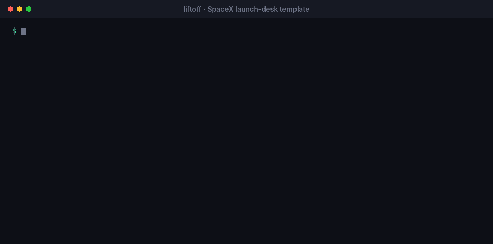
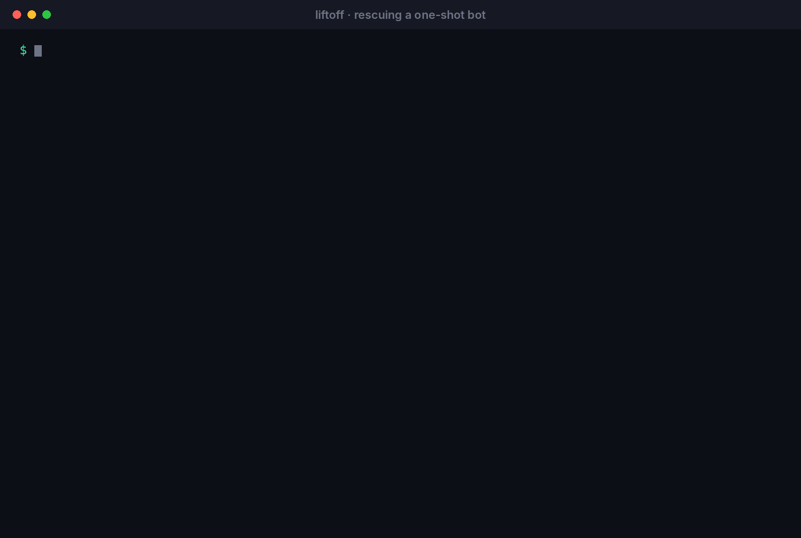
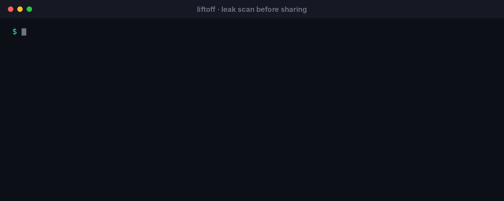

<p align="center">
  
</p>

<p align="center">
  <b>A skill that builds Grok Bot templates people come back to every day, checks them for leaks, and launches them on X.</b><br>
  Grok Bot Creator Rewards pays on how many people use your template and how consistently they keep using it. liftoff measures that before you ship.
</p>

<p align="center">
  
  
  
  <a href="https://github.com/Extradry1111/liftoff/actions/workflows/test.yml"></a>
  
</p>

<p align="center">
  <br>
  <sub>A real run on the included SpaceX launch-desk template. &nbsp;▶ <a href="media/demo.mp4">MP4 version</a></sub>
</p>

---

## 🧭 The problem

On **Aug 28, 2026** Grok Bot shipped **Templates**: set a bot up once, share a link, and anyone can copy it. On **Sep 26** SpaceXAI opened the **Grok Bot Template Rewards** pilot, which pays creators every two weeks, in USD, to X Money.

The terms name what the payouts are based on: **how many people use your template, and how consistently they keep using it.**

Most people will build what's easy to build. A logo generator or a bio writer gets copied, used once and forgotten. Some will also ship their API keys inside the share link, because templates copy your instructions, skills and routines **exactly as written**.

## 💡 What liftoff does

| Tool | What it tells you |
|---|---|
| **Stickiness Score** (0-100) | Will people come back tomorrow? It checks 8 habits of bots people reuse (a daily routine, live data, memory, a fast first win, focus, reliable triggers, an off switch, short instructions) and gives a fix for each one you're missing. |
| **Leak Scan** | Everything that would ship inside your share link: API keys, tokens, webhooks, emails, phone numbers, private links. It also flags the things that **won't travel**, like logins, custom code and private MCP servers, which break the bot for everyone who copies it. |
| **Launch Check** | Is the X post ready? It checks for the share link (a program rule), a hook under 110 characters, no em dashes, no hype words, and money claims that need proof. It also reminds you about the paid partnership label. |
| **Template Card** | One file with every block to paste into Grok Bot, in order. |
| **SpaceX launch desk** | A complete template that scores 100/100. It sends a daily launch brief, T-60 alerts with stream links, post-flight recaps that keep confirmed and rumor apart, and X post drafts. |

The skill drives all of it. Tell it an idea and it scores the idea, builds the template, runs the script until the score is 80 or higher, scans it and packs it. Then it writes the launch post.

---

## 🎬 See it in action

### Rescuing a one-shot bot: 5 → 100

A "logo generator" bot is the classic one-and-done. liftoff turns it into **Brand Radar**, which sends a daily design brief and critiques your logo. It's the same niche, but now people have a reason to come back.

<p align="center"></p>

### Leak Scan: caught before it shipped

This bot has a teammate's email, a phone number, a Slack webhook and an API key in its instructions, plus a step that depends on a login. Every one of those would have gone out with the share link.

<p align="center"></p>

Secrets are never printed in full, only the first 4 characters or the host.

---

## 📦 Install

**Claude (claude.ai, Claude Code, Claude Desktop):** download [`dist/liftoff.skill`](dist/liftoff.skill) and add it under *Settings → Capabilities → Skills*, or:

```bash
git clone https://github.com/Extradry1111/liftoff
cp -r liftoff/liftoff ~/.claude/skills/liftoff
```

**Grok Bot:** add the `liftoff/` folder as a skill, keeping `SKILL.md` at the folder's top level. Grok Bot skills use the same `SKILL.md` format.

**Just the script:** `python3 liftoff/scripts/liftoff.py --help`. It has no packages to install and runs offline.

## 🛠 How to use it

### Quick start: 4 things to try

```
"I want to build a Grok Bot template that makes money. Give me ideas."
"Build me a Grok Bot for Starlink coverage news."
"Here's my bot [paste]. Is it ready to share?"
"Set up the SpaceX launch-desk bot for me."
```

### Recipe 1: idea → template in one conversation

> *"Build a Grok Bot template for crypto token unlocks."*

The skill:
1. scores the idea on 6 questions (recurring job, routine-able, live data, memory, 30-second win, shareable)
2. scaffolds it, fills every blank, and writes a daily routine
3. runs `score` and fixes misses until the score is 80+
4. runs `scan` until it says SAFE TO SHARE
5. hands you `TEMPLATE_CARD.md` to paste into Grok Bot

### Recipe 2: audit a bot you already have

Paste its instructions, skills and routines. You get the score, every leak (masked) and the top 3 fixes ranked by points, then before → after.

### Recipe 3: launch it

Give it the share link and a screenshot of a real output. You get 2 hook options and 3 follow-up quote-posts, all passed through Launch Check.

### Recipe 4: log your payouts

Every two weeks: *"Got $X from rewards this period."* It keeps a table of each payout next to what you changed, and suggests one experiment per template.

## 🖥 The script on its own

```bash
S=liftoff/scripts/liftoff.py

python3 $S new "Starlink Watch" -o my-bots      # scaffold (score is capped at 40 until every [FILL] is done)
python3 $S score my-bots/starlink-watch         # Stickiness Score + fixes
python3 $S scan  my-bots/starlink-watch         # Leak Scan, exit 1 if anything leaks
python3 $S post  launch.txt                     # Launch Check for your X post
python3 $S check my-bots/starlink-watch --post launch.txt   # everything
python3 $S pack  my-bots/starlink-watch         # TEMPLATE_CARD.md
```

Add `--json` to `score`, `scan`, `post` or `check` for machine output.

### Block leaks in CI

```yaml
# .github/workflows/liftoff.yml
name: liftoff
on: [push, pull_request]
jobs:
  scan:
    runs-on: ubuntu-latest
    steps:
      - uses: actions/checkout@v4
      - run: python3 liftoff/scripts/liftoff.py scan my-bots/starlink-watch
```

## 🔬 How the Stickiness Score works

| Check | Points | What earns it |
|---|---|---|
| Comes back on its own | 25 | A schedule in `ROUTINES.md` (15) that runs daily or more often (+10) |
| Fresh every day | 15 | Live web/X data, news, prices |
| Remembers the user | 15 | Instructions say what to remember and reuse |
| 30-second first win | 15 | A `## First message` that asks a question and gives a prompt to try |
| Does one job well | 10 | 1-3 skills |
| Skills trigger reliably | 10 | Every skill description says when to use it |
| Easy to turn down | 5 | Users can mute alerts or ask for less |
| Short instructions | 5 | `BOT.md` under 500 words |
| Won't travel | −10 each | Logins, custom code, private MCP servers, localhost |

**It's a heuristic built on the factors X has named publicly, not X's payout formula.** A high score means you avoided the ways templates usually fail. It doesn't guarantee a payout.

## 🚀 The SpaceX launch desk

`liftoff/templates/liftoff-spacex/` is ready to use:

| Routine | When | Sends |
|---|---|---|
| Morning brief | 08:00 daily | Next 72h of launches in your timezone and UTC, with why each matters |
| T-minus alert | 60 min before | Confirmed time, official stream, a ready-to-post draft |
| Post-flight | T+30 min | What happened, confirmed vs. unconfirmed, a recap draft |
| Weekly wrap | Sunday | The week in launches, and the one to watch next |

Three skills power it: `launch-desk` (cross-checks every time against SpaceX, NASA and the FAA), `starship-explainer` (any flight in 60 seconds of reading) and `launch-post`. Before you share it as your template, give it your own angle, like Starship only, Starlink coverage or a Starbase local feed.

## ❓ FAQ

**Will this make me money?**
Maybe. The rewards pilot is **invite-only**: US-based, 18+, with a Grok Bot account, an X account in good standing and an eligible Premium plan. Payouts are **discretionary**. X says plainly that it's not a revenue share and there's no guaranteed income. liftoff improves your odds by helping you build what the program says it rewards. Nobody can promise a number.

**How do I get into the pilot?**
By invite. Full rules and sources are in [`liftoff/references/rewards-program.md`](liftoff/references/rewards-program.md).

**Does it work without code execution?**
Yes. The skill falls back to checking by hand against the same rubric, and it tells you when it did.

**Is the launch data real?**
The bot uses Grok's live web and X search, and it marks every time with "last checked". Launch times slip, so verify against SpaceX before you post a time as fact.

**Affiliated with SpaceX, SpaceXAI or X?**
No.

## 📁 What's inside

```
liftoff/                     ← the skill (install this folder)
  SKILL.md                   modes: BUILD · AUDIT · LAUNCH · LOG · LIFTOFF
  scripts/liftoff.py         score · scan · post · check · pack · new
  references/                stickiness rubric, leaks, launch posts, rewards program, 30 ranked ideas
  templates/liftoff-spacex/  the SpaceX launch desk (100/100)
  examples/                  logo-bot (5) → logo-bot-v2 (100), leaky-bot (4 leaks)
tests/                       15 tests: python3 -m unittest discover tests
dist/liftoff.skill           installable package
media/                       demo GIFs + MP4s rendered from real runs
```

## 🤝 Contributing

PRs are welcome, especially new templates that score 80+ and pass the Leak Scan, and new leak patterns. Run the tests first.

## License

MIT
